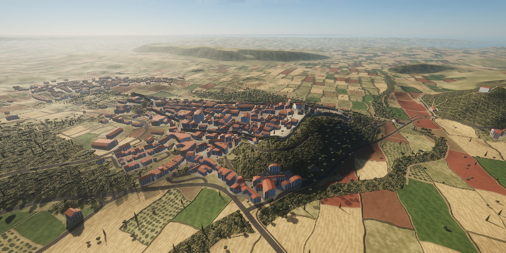
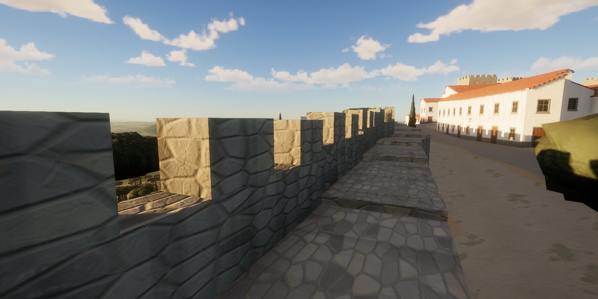

# Castelo

Walk the walled medieval town of Óbidos, Portugal, in the browser. Wander up Rua Direita from the main gate,
climb a flight of stone steps onto the walls, follow them round, and watch the sun go down over the Várzea
from the west wall. It runs on WebGPU and WGSL with a small rendering engine of its own, forked from
[Tidewater](https://github.com/dgreenheck/tidewater).






## Requirements

- A browser with WebGPU: a recent Chrome, Edge or Safari.
- A capable GPU. A frame takes about 12 ms of GPU time at 2560×1267 on an Apple M-series laptop.
- The first load compiles the shaders, which can take a little while. Later visits are faster because the
  browser caches them.

## The place

The town is built from real data:

- **Terrain**: the Copernicus 30 m elevation model. A 2 km heightmap at 1 m resolution covers the town,
  and a 48 km mesh carries the land out to the horizon: the Várzea, the hills, and the Atlantic and the
  Lagoa de Óbidos to the west.
- **Town**: OpenStreetMap supplies the wall circuit, towers, gates, streets, land use and about 900
  building footprints.
- **Walls**: the curtain and the castle enclosure have a walkable wall walk that steps up and down with the
  ridge. A crenellated parapet runs on the outer side and there is no railing on the town side, as at
  Óbidos. Gates are arched passages where the streets cross the wall, and flights of stone steps lead up
  from the streets.
- **Houses**: whitewashed, with the town's blue, yellow and ochre bands and window surrounds, and gable
  roofs of canudo tiles.
- **Trees**: cypresses, olives, umbrella pines and garden trees. The fields of the Várzea are a
  procedural patchwork of stubble, ploughed earth, olive groves, vineyards and green plots.
- **Sky and light** are kept from Tidewater: the physically based sky and atmosphere, volumetric clouds,
  aerial perspective, sun shafts, cascaded shadows, GTAO, temporal upscaling, bloom and auto exposure. The
  sun follows Óbidos' latitude, the time of day and the season. At dusk the wall lanterns and some windows
  light up.

The coordinates are metres from the centre of the walls, with x east and z south. The long straight wall
on the west side faces the sunset all year.

## Controls

| Key | Action |
|---|---|
| W A S D | Move |
| Mouse | Look (click to capture the mouse, Esc to release) |
| Shift | Run |
| Space | Jump |
| C | Crouch |
| F | Free camera (press again to drop to your feet where you are) |
| T | Let the day run / pause time |
| L | Flashlight |
| H | Settings panel: time of day, day of the year, clouds, haze, post-processing, render scale |
| P | Photo mode |
| F1 or ? | All controls |

## URL options

| Option | Effect |
|---|---|
| `fly` | Start in the free camera |
| `noClouds` | Skip the volumetric clouds |
| `noHaze` | Skip the haze and sun shafts |
| `noVeg` | Skip the trees |
| `bg` | Keep rendering when the tab is hidden (automation) |
| `bench&shots=gate,westWall,…` | Render reference shots of the named views (`src/core/DebugViews.js`) and post them to a local collector |

## Running locally

```sh
npm install
npm run dev      # http://127.0.0.1:5189
npm test         # walks the town and the walls headlessly, then an engine smoke test
npm run build    # static build in dist/
```

`.github/workflows/deploy.yml` builds and deploys to GitHub Pages. Its trigger is manual for now. Enable
Pages (Settings → Pages → Source: GitHub Actions) and run it from the Actions tab.

### Rebuilding the geodata

```sh
sh tools/geodata/fetch.sh          # OpenStreetMap (Overpass API) + Copernicus DEM tiles, into tools/geodata/raw/
node tools/geodata/build.mjs       # -> public/data/dem-*.bin, src/world/obidos/osm.json
```

## Project layout

| Folder | Contents |
|---|---|
| `src/world/obidos/` | Óbidos: geodata loading and geometry helpers, walls / towers / gates / stairs, houses, trees, town materials |
| `src/world/` | Terrain heightmap and masks (`TerrainData`), the CDLOD terrain and its material, the far terrain, colliders |
| `src/engine/` | The rendering engine: math, scene graph and geometry, GPU resources, WGSL shader composition, materials, lighting and shadows |
| `src/sky/` | Atmosphere, clouds, sky and environment |
| `src/post/` | Post chain: AO, haze, TAAU, motion blur, bloom, lens flare |
| `src/materials/` | Shared lighting: shadow filtering, bounce light, local lights |
| `src/player/` | The walker and the free camera |
| `src/ui/` | Settings panel, loading screen and HUD |
| `tools/geodata/` | Fetches and converts the OpenStreetMap and DEM data |
| `test/` | The Óbidos world test, engine and post-chain smoke tests |

## Credits

Map data © OpenStreetMap contributors (ODbL). Elevation data: Copernicus WorldDEM-30 © DLR e.V. and © Airbus
Defence and Space GmbH, provided under COPERNICUS by the European Union and ESA. The engine, sky and post
chain come from Tidewater by DRG Software Solutions LLC (MIT). Full details are in [CREDITS.md](CREDITS.md).
